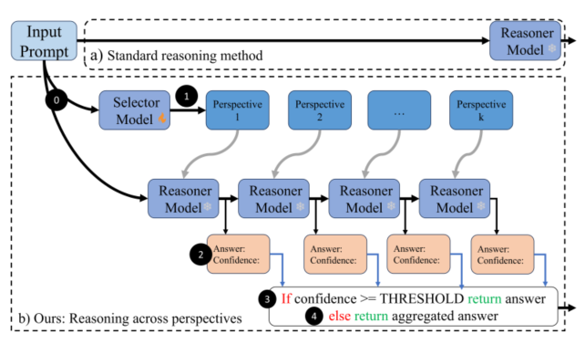

# MIRAGE: Multi-Perspective Creative Language Model Reasoning with Reinforcement Learning Guidance

**Arash Lagzian**, **Srinivas Anumasa**, **Dianbo Liu**
National University of Singapore

Accepted at the ICML 2025 Workshop on **Multi-Agent Systems in the Era of Foundation Models: Opportunities, Challenges and Futures (MAS-2025)**

[[Workshop Page]](https://icml.cc/virtual/2025/49301) [[Paper (PDF)]](./MIRAGE_ICML2025_Workshop.pdf)

## Abstract

Recent advances in Large Language Models (LLMs) have revolutionized artificial intelligence and how human interact with AIs. Despite impressive advancements, LLMs struggle with complex mathematical, scientific, and logical tasks. Inspired by human cognitive flexibility—our ability to dynamically switch mental perspectives—we propose MIRAGE (Multi-perspective Inference-time Reasoning via Agent-Guided Exploration), a novel inference-time creative thinking framework. MIRAGE includes a Selector that prioritizes effective conceptual perspectives (e.g., algebraic, probabilistic) and a Reasoner that sequentially solves tasks until a confident solution emerges, otherwise aggregating multiple perspectives. Tested on GSM8K, MATH500, MMLU-Pro, and Game-of-24 benchmarks, MIRAGE consistently outperforms methods like Chain-of-Thought and diverse prompting ensembles, significantly boosting accuracy with minimal inference overhead, providing a scalable solution for practical applications.

## Overview
<p align="center">
  
</p>

MIRAGE proceeds in four stages: (1) the Selector ranks conceptual reasoning perspectives, (2) the Reasoner solves the problem under each selected perspective, (3) if confidence exceeds a threshold the answer is returned, and (4) otherwise the answers across perspectives are aggregated. Averaging fewer than two forward passes across four benchmarks, MIRAGE requires no parameter updates to the base LLM.


**Algorithm 1** Inference-Time Multi-Perspective Reasoning

```
Require: query q, perspective set S = {s1, ..., sn}, selector SELECTOR,
         reasoner REASONER, confidence threshold tau, max attempts k
---------------------------------------------------------------------
 1:  S_ranked <- SELECTOR(q)                  // rank perspectives by p(si | q)
 2:  H <- {}                                  // init reasoning history
 3:  for t = 1 to k do
 4:      s_t <- S_ranked[t]                   // next top-ranked perspective
 5:      q_t <- TRANSFORM(q, s_t, H)          // adapt query to this perspective
 6:      (a_t, c_t) <- REASONER(q_t, s_t)     // answer + confidence
 7:      if c_t >= tau then
 8:          return a_t                       // confident answer found
 9:      H <- H U {(s_t, a_t, c_t)}           // update reasoning history
10:  end for
11:  return AGGREGATE({(a_1, c_1), ..., (a_k, c_k)})   // fallback: aggregate
---------------------------------------------------------------------
```

## Code

Code and the selector training scripts used in this work will be released here. Check back soon, or open an issue if you'd like early access.

## Citation

If you find this work useful, please cite:

```bibtex
@inproceedings{lagzian2025mirage,
  title     = {{MIRAGE}: Multi-Perspective Creative Language Model Reasoning with Reinforcement Learning Guidance},
  author    = {Lagzian, Arash and Anumasa, Srinivas and Liu, Dianbo},
  booktitle = {ICML 2025 Workshop on Multi-Agent Systems in the Era of Foundation Models: Opportunities, Challenges and Futures (MAS-2025)},
  year      = {2025}
}
```

## Contact

For questions, reach out to Arash Lagzian (arash.lagzian94@gmail.com).
